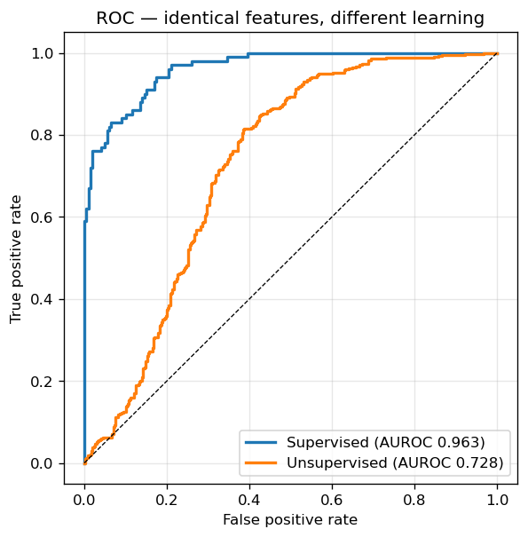
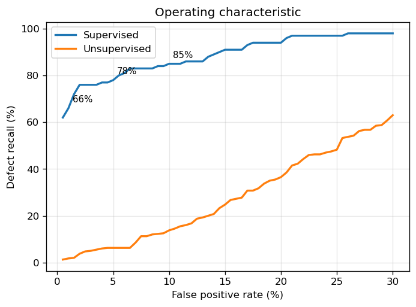
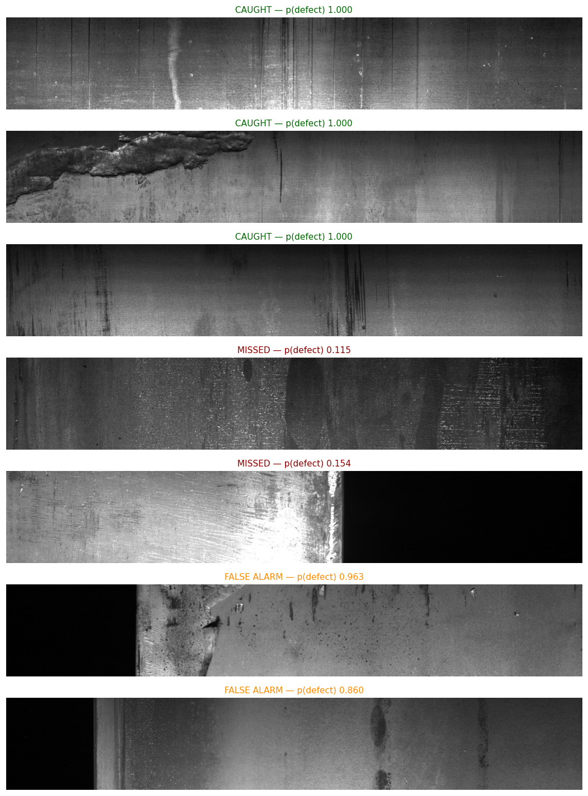
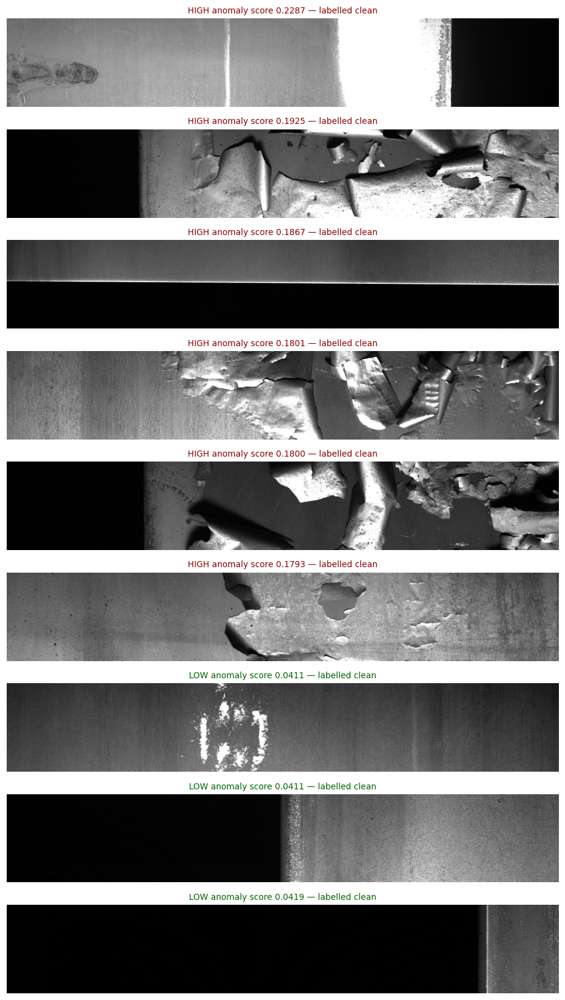
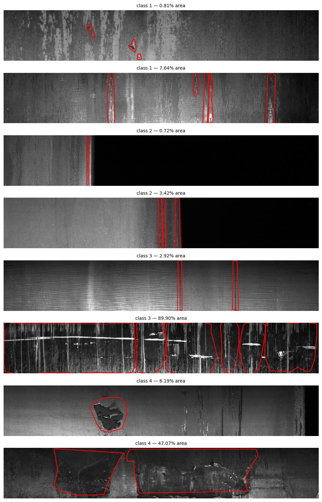

# Steel Surface Defect Detection

Image-level defect classification on the [Severstal](https://www.kaggle.com/competitions/severstal-steel-defect-detection) hot-rolled steel strip dataset — 12,568 line-scan camera images from a flat-rolled production line, spanning four surface defect classes that differ by more than an order of magnitude in both frequency and physical extent.

Given a strip image, the system returns a defect probability and a PASS / REVIEW decision against a threshold you choose. That threshold is calibrated on known-good material to a target false-alarm rate — so the operating point is set by inspection economics, not by whatever maximised accuracy on a test split.

There is no training loop. A frozen self-supervised backbone (DINOv2) converts each image to a feature vector in one forward pass, and a linear classifier is fit on top in under a second on CPU. No GPU cluster, no fine-tuning, no hyperparameter search — which also means retraining on plant-specific imagery is a minutes-long job, not a project.

---

## Result

**Out of every 100 defective strips, the system flags 93 while stopping the line unnecessarily on 5% of good strips. Tighten it to 1% unnecessary stops and it still catches 81.**

Cross-validated AUROC: **0.9747** (5-fold, range 0.968–0.979). Held-out test AUROC: 0.9884.

*Reading the numbers:* **recall** is the share of real defects caught. **False-positive rate** is the share of good strips wrongly flagged — each one costs an operator a few minutes of review. The two move together: catching more defects always means reviewing more good material. **AUROC** summarises performance across every possible threshold, where 0.5 is a coin flip and 1.0 is perfect.

### Operating points

| False-positive rate | Defect recall |
|---|---|
| 1% | 81.0% |
| 5% | 93.0% |
| 10% | 96.0% |
| 20% | 100.0% |

### What that means per 1,000 strips

| Operating point | Defects caught | Defects missed | Unnecessary stops |
|---|---|---|---|
| 1% FPR | 81 | 19 | 9 |
| 5% FPR | 93 | 7 | 45 |
| 10% FPR | 96 | 4 | 90 |
| 20% FPR | 100 | 0 | 180 |

*Assumes 10% defect prevalence — an illustrative figure, not a measured property of the dataset. Choosing between these rows is a cost decision: it depends on what a missed defect costs relative to a few minutes of operator review.*

### Per-class recall @5% FPR

| Class | Instances in dataset | Median defect area | Recall |
|---|---|---|---|
| 1 | 897 | 0.81% | 94.0% |
| 2 | 247 | 0.72% | 94.0% |
| 3 | 5,150 | 2.92% | 100.0% |
| 4 | 801 | 6.19% | 99.0% |

Evaluated on 100 held-out images per class, none seen in training.




### What detections actually look like



**Confident detections (top three, p ≈ 1.00).** Unambiguous surface damage — heavy scoring, spalling, gouging. These are the cases where any inspection method would agree.

**Misses (middle two, p = 0.115 and 0.154).** Both are low-contrast, diffuse surface texture with no strong localised feature. The failure mode is consistent: the system is confident about discrete damage and uncertain about broad, subtle variation in surface finish. If those matter on a given line, they are the cases to route to manual inspection regardless of model output.

**"False alarms" (bottom two, p = 0.963 and 0.860).** Both are labelled clean in the dataset. Both visibly contain pitting and dark blotching. These are not model errors — they are correct detections scored against incorrect labels.

That last point has a practical consequence: an unknown share of the measured 5% false-positive rate consists of correct detections on mislabelled images. **The true false-positive rate is therefore better than the reported figure**, though by how much cannot be quantified without re-annotating the negatives by hand.

### What detections look like


Confident detections (top) are unambiguous — spalling, heavy scoring, gouging. Misses (middle, p = 0.115 and 0.154) are low-contrast diffuse texture with no strong localised feature.

The two "false alarms" (bottom, p = 0.96 and 0.86) both show visible pitting and dark blotching. They are labelled clean in the dataset. This is the contamination described below surfacing directly in the results: some measured false positives are correct detections scored against incorrect labels, so the true false-positive rate is likely better than reported.

---

## Method

### Feature extraction

**DINOv2 ViT-S/14, frozen.** A Vision Transformer trained self-supervised on 142M images. Self-supervised features transfer better to texture and out-of-domain data than ImageNet-supervised features, which are optimised for object categories irrelevant to steel. Freezing it means no training on consumer hardware — extraction is a single forward pass.

- Input resized to **252×1596**, preserving native aspect ratio. This matters: at 224×224 the horizontal axis compresses 7× and thin longitudinal defects disappear.
- Patch tokens from layers 3 and 9, concatenated (768-dim). Early layers carry texture and edges; mid layers carry structure. Defects appear at both scales.
- 3×3 average pooling, stride 2 → 513 patches × 768 dims per image.

### Classifier

Patch features mean-pooled to one 768-dim vector per image. Logistic regression on 1,000 clean + 1,000 defective images, evaluated on 200 clean + 100 defective held out, plus 100 held-out images per defect class.

Logistic regression rather than fine-tuning, deliberately: fine-tuning would change the representation and prevent a like-for-like comparison with the unsupervised branch below. A linear probe succeeding means the frozen features already contain the necessary information.

### Calibration — how the threshold is chosen

The classifier outputs a probability between 0 and 1. Turning that into a PASS / REVIEW decision requires a cut-off, and where you put it determines everything about how the system behaves in practice.

The cut-off here is set from the score distribution of **known-good material only** — never using test defects. To operate at a 5% false-alarm rate, take the 95th percentile of the scores the model assigns to good strips and use that as the threshold. By construction, 5% of good material will exceed it.

This mirrors deployment. A plant commissioning an inspection system has plenty of good material to run through it and no catalogue of labelled defects waiting in advance. Calibrating on the negatives is the only procedure that works on day one — and it means the false-alarm rate is a dial the plant sets, not a property of the model.

---

## Training data was the binding constraint

The first configuration used 300 clean + 300 defective images. Tripling that produced the single largest improvement in the project:

| | 300 + 300 | 1,000 + 1,000 |
|---|---|---|
| AUROC (5-fold CV) | 0.9536 | **0.9747** |
| Recall @1% FPR | 66.0% | **81.0%** |
| Recall @5% FPR | 78.0% | **93.0%** |
| Class 2 recall @5% FPR | 72.0% | **94.0%** |

Class 2 is the rarest defect (247 instances) and the smallest by median area. At 300 training images its recall lagged the other classes by 12–19 points, which looked like a property of the defect type. It was not — it was a data-quantity artifact, and it disappeared with more labels.

**This remains a floor, not a ceiling.** The dataset offers 6,666 labelled defective images against the 2,000 used here. Larger DINOv2 variants (ViT-B/L) trade memory for accuracy. Fine-tuning the backbone rather than freezing it typically adds several points. Mean pooling discards spatial information that a patch-attention head would retain. The remaining gap to published results on this dataset is mostly compute and labels rather than method.

---

## Comparison: unsupervised anomaly detection on identical features

A natural question for industrial inspection is whether defect labels are needed at all. Unsupervised anomaly detection learns a model of *normal* material and flags deviation, which is attractive because new defect modes appear that no labelled set anticipated.

This was tested using the same frozen features, so the only variable is whether labels are used.

**Method.** PatchCore-style memory bank built from patches of 500 unannotated images, subsampled to 150,000 entries. Test patches matched by cosine distance to their nearest bank neighbour; image score is the mean distance of the 10 most anomalous patches. Deviates from the original PatchCore in using random subsampling rather than greedy coreset selection.

**Result.**

| Method | AUROC | Recall @1% FPR | Recall @5% FPR | Recall @10% FPR |
|---|---|---|---|---|
| Supervised | **0.988** | 81.0% | **93.0%** | 96.0% |
| Unsupervised | 0.750 | 1.0% | 12.0% | 35.0% |

At a 1% false-alarm rate — the tightest setting a production line would plausibly run — the unsupervised method catches one defect in a hundred. It is effectively blind at any usable operating point.

### Why it failed: the unannotated images are not defect-free

Severstal never claimed the 5,902 unannotated images contain no defects — they are simply *unlabelled*. Treating them as normal poisons any method that learns a model of normality.

The evidence is direct. Ranking unannotated images by anomaly score and inspecting the highest-scoring ones:



The top-scoring "clean" images show extensive surface flaking and spalling. Some low-scoring ones contain visible bright inclusions, so contamination runs in both directions.

### Ablations

| Configuration | AUROC |
|---|---|
| 224×224 squashed input, 5k memory bank | 0.661 |
| 252×1596, 2.5k bank | 0.529 |
| 252×1596, 50k bank | 0.728 |
| 252×1596, 150k bank | **0.750** |
| 150k bank, training set filtered to cleanest 70% | 0.728 |

Aspect ratio matters more than expected. Memory bank size matters more still — at 2,565 entries the bank was too sparse to cover normal variation and performance fell near chance.

Outlier filtering was expected to help if contamination were the sole problem. It made things worse, indicating the frozen features do not cleanly separate these defects by nearest-neighbour distance regardless of training-set purity.

**Practical conclusion:** unsupervised anomaly detection is viable when clean reference material is guaranteed. It is unreliable when "unlabelled" is silently treated as "normal" — a common condition in datasets assembled from production data.

---

## Dataset

12,568 images at 1600×256 px from line-scan cameras on a flat-rolled production line. The 6.25:1 aspect ratio reflects the imaging geometry — the camera spans strip width while material travels beneath it.

7,095 run-length-encoded defect masks across 6,666 images in four classes. 6,239 images carry one defect type, 425 carry two, 2 carry three. The remaining 5,902 images are unannotated.



---

## Limitations

- **Image-level classification, not localization.** The system detects that a defect is present, not where.
- **Unverified negatives — the false-positive rate is pessimistic.** The images used as "clean" are unannotated, not confirmed defect-free. Two of the highest-scoring false alarms visibly contain pitting and blotching (see *What detections actually look like*), meaning they are correct detections penalised by incorrect labels. Every false-positive figure in this README should therefore be read as an upper bound. Quantifying the real rate would require hand-re-annotating the negative set.
- **Multi-defect images.** 427 images carry more than one defect type, making per-class recall approximate.
- **Public dataset.** Not evaluated on plant-specific imagery; domain shift is untested.
- **Test set size.** 200 clean and 100 defective. Differences of 1–2 points are within noise; the cross-validated figure over 2,000 images is the more reliable number.

---

## Reproducing

```bash
pip install torch torchvision scikit-learn pandas matplotlib pillow
python steel_defect_detection.py --data /path/to/severstal-steel-defect-detection
```

Feature extraction runs at roughly 100 images/minute on an Apple M-series laptop (MPS). Requires `PYTORCH_ENABLE_MPS_FALLBACK=1` — DINOv2's position-embedding interpolation uses an operation not implemented for MPS.

Random seed fixed at 42 throughout. All splits verified non-overlapping.
